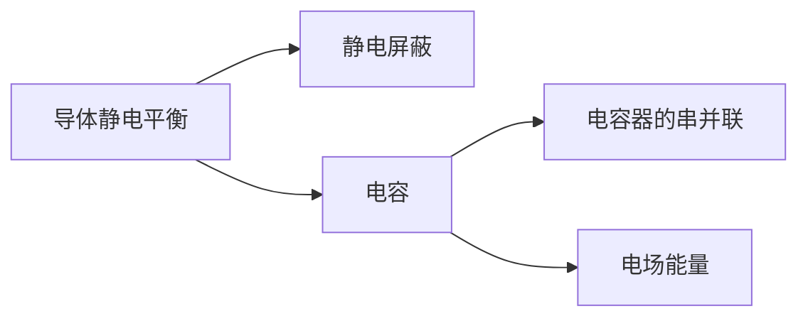

---

tags: [大学物理, 电磁学, 导体, index]

author: mo4mou
---

# 静电场中的导体

> 静电平衡 → 电荷分布 → 静电屏蔽 → 电容 → 电场能量

## 笔记列表

| 笔记 | 核心内容 |
|:----:|:--------:|
| |  |  | 1 - 导体静电平衡 |  |  | | $\vec{E}_{\text{内}}=0$，$E_{\text{表}}=\sigma/\varepsilon_0$ |
| |  |  | 2 - 静电屏蔽 |  |  | | 空腔导体隔绝内外电场 |
| |  |  | 4 - 电容器的串并联 |  |  | | 串联 $1/C_{\text{eq}}=\sum 1/C_i$，并联 $C_{\text{eq}}=\sum C_i$ |
| |  |  | 5 - 电容储能 |  |  | | $W=CU^2/2$，能量密度 $w=\varepsilon_0 E^2/2$ |

## 知识脉络



```dataview
LIST
FROM "大学物理/电磁学/导体"
WHERE file.name != "未命名"
SORT file.name ASC
```

---

> 参见 [[大学物理/笔记写作指南|笔记写作指南]] 和 [[大学物理/规范|符号规范]]
