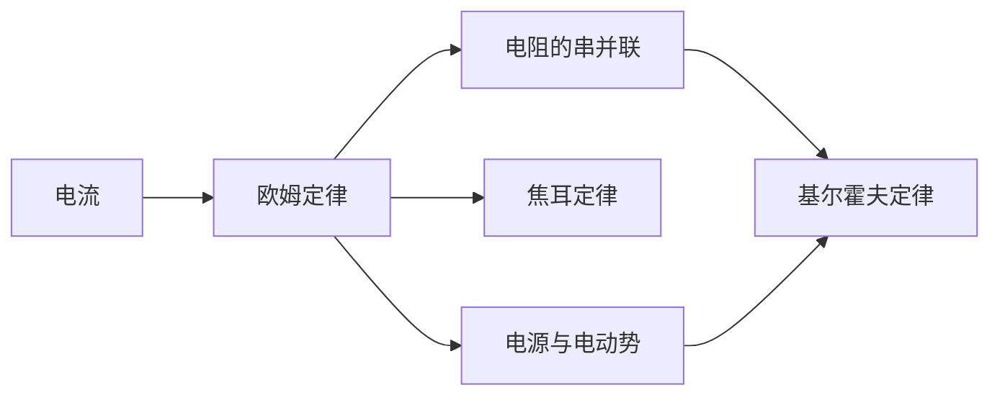

---

tags: [大学物理, 电磁学, 恒定电流, index]

author: mo4mou
---

# 恒定电流

> 电流 → 欧姆定律 → 电路分析 → 能量转化

## 笔记列表

| 笔记 | 核心内容 |
|:----:|:--------|
| |  |  | 1 - 电流 |  |  | | $I = dq/dt$，$\vec{J} = nq\vec{v}_d$，连续性方程 |
| |  |  | 欧姆定律 |  |  | | $U = IR$，$\vec{J} = \sigma \vec{E}$，$R = \rho l/S$，温度系数 |
| |  |  | 2 - 电阻的串并联 |  |  | | 串联 $R_{\text{eq}} = \sum R_i$，并联 $1/R_{\text{eq}} = \sum 1/R_i$ |
| |  |  | 4 - 电源与电动势 |  |  | | $\mathcal{E} = \oint \vec{E}_k \cdot d\vec{l}$，路端电压 $U = \mathcal{E} - Ir$ |
| |  |  | 基尔霍夫定律 |  |  | | KCL: $\sum I = 0$，KVL: $\sum U = 0$ |
| |  |  | 3 - 焦耳定律 |  |  | | $P = UI = I^2R$，$p = \vec{J} \cdot \vec{E} = \sigma E^2$ |

## 知识脉络



```dataview
LIST
FROM "大学物理/电磁学/恒定电流"
WHERE file.name != "未命名"
SORT file.name ASC
```

---

> 参见 [[大学物理/笔记写作指南|笔记写作指南]] 和 [[大学物理/规范|符号规范]]
