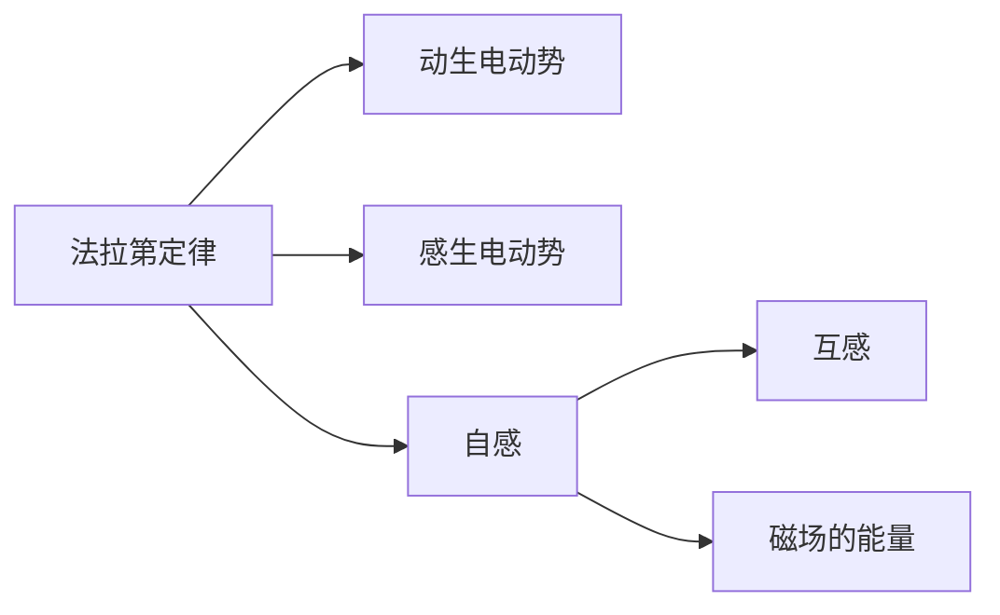

---

tags: [大学物理, 电磁学, 电磁感应, index]

author: mo4mou
---

# 电磁感应

> 法拉第定律 → 两种电动势（动生/感生）→ 自感与互感 → 磁场能量

## 笔记列表

| 笔记 | 核心内容 |
|:----:|:--------|
| |  |  | 1 - 法拉第电磁感应定律 |  |  | | $\mathcal{E} = -d\Phi/dt$，楞次定律 |
| |  |  | 2 - 动生电动势 |  |  | | $\mathcal{E} = \int (\vec{v} \times \vec{B}) \cdot d\vec{l}$，$\mathcal{E}=Blv$ |
| |  |  | 3 - 感生电动势 |  |  | | $\mathcal{E} = -\iint (\partial\vec{B}/\partial t) \cdot d\vec{S}$，$\nabla \times \vec{E} = -\partial\vec{B}/\partial t$ |
| |  |  | 6 - 自感 |  |  | | $L = \Phi/I$，$\mathcal{E}_L = -L\,dI/dt$，$L = \mu_0 n^2 V$ |
| |  |  | 7 - 互感 |  |  | | $\mathcal{E}_2 = -M\,dI_1/dt$，变压器 |
| |  |  | 8 - 磁场的能量 |  |  | | $W = LI^2/2$，$w = B^2/(2\mu_0)$ |

## 知识脉络



```dataview
LIST
FROM "大学物理/电磁学/电磁感应"
WHERE file.name != "未命名"
SORT file.name ASC
```

---

> 参见 [[大学物理/笔记写作指南|笔记写作指南]] 和 [[大学物理/规范|符号规范]]
