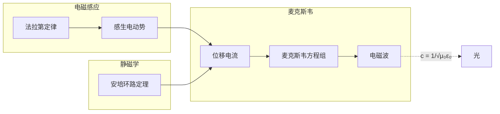

---

tags: [大学物理, 电磁学, 麦克斯韦方程组, index]

author: mo4mou
---

# 麦克斯韦方程组

> 位移电流 → 麦克斯韦方程组 → 电磁波（光）

## 笔记列表

| 笔记 | 核心内容 |
|:----:|:--------|
| |  |  | 5 - 位移电流 |  |  | | $\vec{J}_d = \varepsilon_0 \partial\vec{E}/\partial t$，全电流定律 |
| |  |  | 1 - 麦克斯韦方程组 |  |  | | 四个方程积分/微分形式及其物理意义 |
| |  |  | 2 - 电磁波 |  |  | | $c = 1/\sqrt{\mu_0\varepsilon_0}$，$\vec{S} = (\vec{E}\times\vec{B})/\mu_0$ |

## 麦克斯韦方程组总览

| # | 名称 | 微分形式 | 物理意义 |
|:-:|:----:|:--------|:---------|
| ① | 电场高斯 | $\nabla \cdot \vec{E} = \rho/\varepsilon_0$ | 电荷是电场源 |
| ② | 磁场高斯 | $\nabla \cdot \vec{B} = 0$ | 无磁单极子 |
| ③ | 法拉第 | $\nabla \times \vec{E} = -\partial\vec{B}/\partial t$ | 变化磁场→电场 |
| ④ | 安培-麦克斯韦 | $\nabla \times \vec{B} = \mu_0 \vec{J} + \mu_0\varepsilon_0 \partial\vec{E}/\partial t$ | 电流/变化电场→磁场 |

## 全章知识脉络



```dataview
LIST
FROM "大学物理/电磁学/麦克斯韦方程组"
WHERE file.name != "未命名"
SORT file.name ASC
```

---

> 至此电磁学核心体系完成。参见 [[大学物理/笔记写作指南|笔记写作指南]] 和 [[大学物理/规范|符号规范]]
